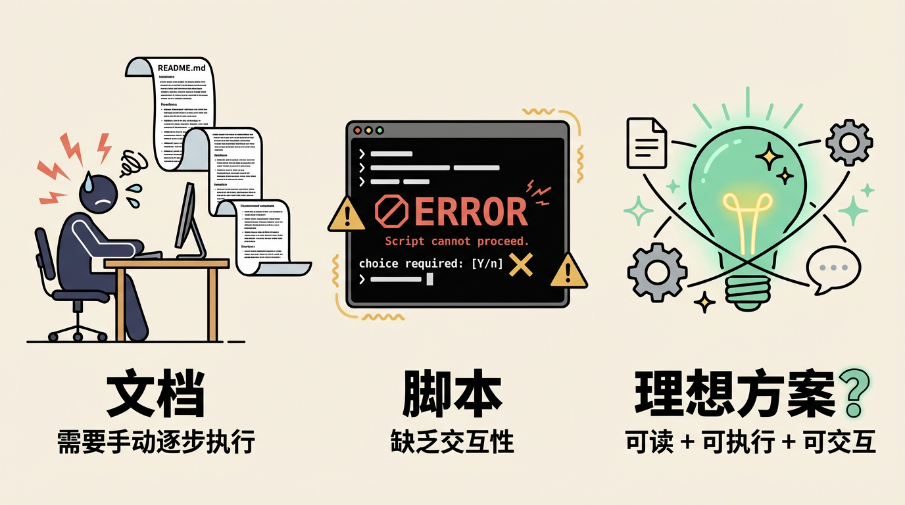
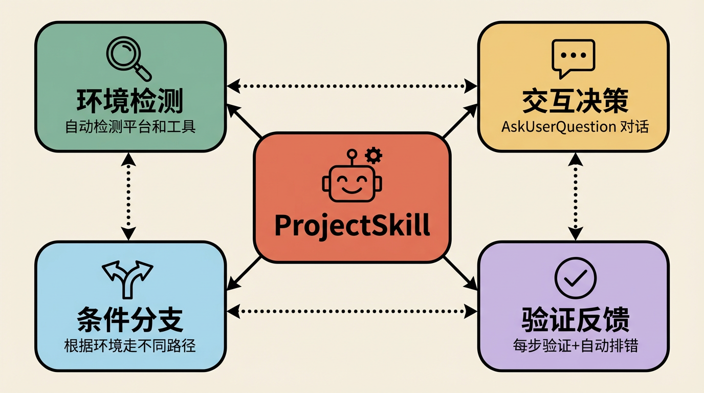
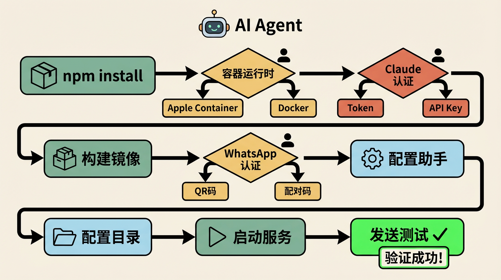
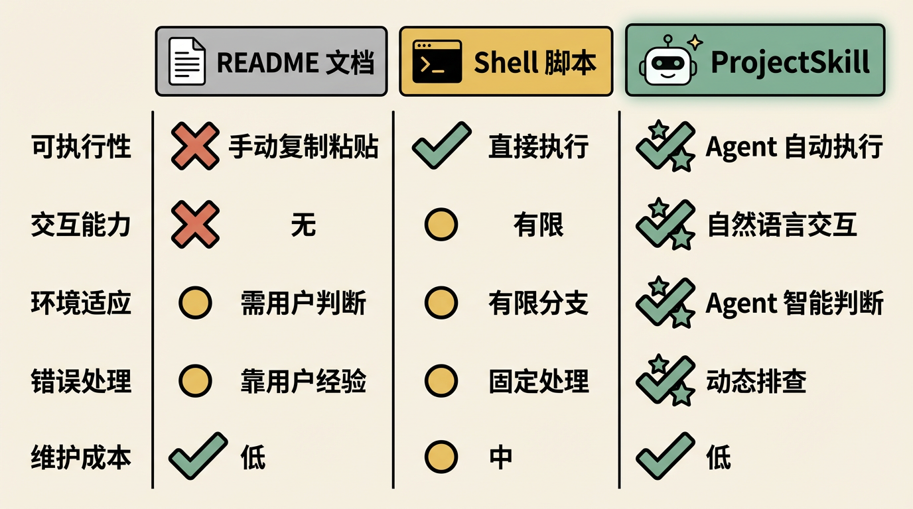

# on-my-projectskill: 让项目安装配置变成可执行的Agent Skill

## 每个项目都有一本"安装圣经"

做开发的人大概都经历过这样的场景：clone 一个新项目，打开 README，看到密密麻麻的安装步骤——装依赖、配环境变量、选容器运行时、认证第三方服务、启动后台进程、验证部署是否成功。每一步都可能踩坑，每一步都需要根据自己的环境做判断。

传统的做法是写一份详细的文档，或者写一个 `setup.sh` 脚本。文档的问题是用户需要自己逐步执行并处理异常；脚本的问题是缺乏交互性，遇到需要用户选择的场景（比如选 Docker 还是 Apple Container）就力不从心了。

有没有一种方式，既有文档的可读性，又有脚本的可执行性，还能在关键节点与用户交互？

**on-my-projectskill** 就是为了解决这个问题而生的。



## 什么是 ProjectSkill

ProjectSkill 是一种项目级别的 Agent Skill 模板。它把项目的安装、配置、部署等流程编写成 Claude Code 可以理解和执行的 Skill 文件，让 AI Agent 代替用户完成那些繁琐的环境配置工作。

核心思路很简单：**把安装文档变成 Skill，让 Agent 来执行。**

与传统 shell 脚本不同的是，Skill 天然支持以下能力：

- **环境检测**：Agent 可以运行命令检查当前系统平台、已安装的工具版本、运行时状态
- **交互决策**：在需要用户做选择时（如选择容器运行时、认证方式），Agent 通过 `AskUserQuestion` 与用户对话
- **条件分支**：根据检测结果和用户选择，自动走不同的安装路径
- **验证反馈**：每个步骤完成后运行验证命令，确认是否成功，失败时自动进入 troubleshooting 流程



## 参考NanoClaw设计

on-my-projectskill 的灵感来源于 [NanoClaw](https://github.com/nichochar/nanoclaw) 项目。NanoClaw 是一个基于 WhatsApp 的 AI Agent 平台，部署它需要完成以下步骤：

1. 安装 npm 依赖
2. 选择并安装容器运行时（Apple Container 或 Docker）
3. 配置 Claude 认证（订阅 Token 或 API Key）
4. 构建容器镜像
5. 完成 WhatsApp 认证（QR 码或配对码）
6. 配置助手名称和主频道
7. 配置外部目录访问权限
8. 设置 launchd 后台服务
9. 发送测试消息验证

这 9 个步骤中，几乎每一步都涉及环境判断和用户选择。NanoClaw 团队把整个流程写成了一个 setup skill，用户只需要对 Agent 说一句"帮我安装"，Agent 就会自动完成所有步骤，在需要时暂停询问用户。

来看一个具体的例子。在安装容器运行时这一步，Skill 的逻辑是这样的：

```markdown
## 2. Install Container Runtime

First, detect the platform and check what's available:

    echo "Platform: $(uname -s)"
    which container && echo "Apple Container: installed" || echo "Apple Container: not installed"
    which docker && docker info >/dev/null 2>&1 && echo "Docker: installed and running" || echo "Docker: not installed or not running"

### If NOT on macOS (Linux, etc.)
Apple Container is macOS-only. Use Docker instead.

### If on macOS
**If Apple Container is already installed:** Continue to Section 3.
**If Apple Container is NOT installed:** Ask the user:
> 1. **Apple Container** (default) - macOS-native, lightweight
> 2. **Docker** - Cross-platform, widely used
```

Agent 会先运行检测命令，根据结果判断平台和已有工具，然后在需要时询问用户偏好。整个过程对用户来说就像和一个经验丰富的运维工程师对话。



## on-my-projectskill 的设计理念

在 NanoClaw 的实践基础上，on-my-projectskill 提炼出通用的 Skill 模板，让任何项目都能快速创建自己的 setup skill。

### 一个好的 ProjectSkill 应该具备什么

**1. 自动执行，必要时暂停**

Skill 文件开头就应该明确执行策略：

```markdown
Run all commands automatically.
Only pause when user action is required.
```

Agent 应该尽量自动化，只在真正需要用户干预时才暂停——比如需要扫码认证、需要用户做出架构选择等。

**2. 环境感知**

不要假设用户的环境。先检测，再行动：

```markdown
## Check Prerequisites
Detect OS, check installed tools, verify versions.
Choose the installation path based on detection results.
```

**3. 使用 AskUserQuestion 进行交互**

当需要用户做选择时，使用 Claude Code 内置的 `AskUserQuestion` 工具，而不是简单地输出文本等用户回复。这样能提供结构化的选项，体验更好：

```markdown
**UX Note:** When asking the user questions, prefer using
the `AskUserQuestion` tool instead of just outputting text.
```

**4. 每步验证**

每个安装步骤后面都跟一个验证命令，确认步骤成功完成：

```markdown
## Install Dependencies
npm install

## Verify
node --version && npm list --depth=0
```

**5. Troubleshooting 内置**

把常见问题的排查方法直接写在 Skill 里，Agent 遇到错误时可以自动尝试修复：

```markdown
## Troubleshooting
**Service not starting**: Check logs/error.log
**Container fails**: Ensure runtime is running, check container logs
```

### 模板结构

一个典型的 ProjectSkill setup 模板遵循以下结构：

```
---
name: setup
description: Run initial project setup...
---

# Project Setup

## 1. Check Prerequisites
(环境检测)

## 2. Install Dependencies
(依赖安装)

## 3. Configure Environment
(环境配置，含用户交互)

## 4. Build & Deploy
(构建部署)

## 5. Verify
(验证测试)

## Troubleshooting
(常见问题)
```

## Skill 不只是 setup

虽然 setup 是最典型的场景，但 ProjectSkill 的思路可以扩展到更多场景：

- **`/diagnose`** - 项目健康检查，自动排查常见问题
- **`/deploy`** - 带交互确认的部署流程
- **`/migrate`** - 数据库迁移或版本升级引导
- **`/onboard`** - 新成员入职，介绍项目架构和开发规范
- **`/release`** - 发版流程，包括 changelog 生成、版本号更新、tag 创建

每一个都可以写成 Skill，让 Agent 来引导执行。

## 与传统方案的对比

| 维度 | README 文档 | Shell 脚本 | ProjectSkill |
|------|------------|-----------|-------------|
| 可读性 | 好 | 一般 | 好（Markdown 格式） |
| 可执行性 | 需手动复制粘贴 | 直接执行 | Agent 自动执行 |
| 交互能力 | 无 | 有限（read/select） | 自然语言交互 |
| 环境适应 | 需用户自行判断 | 有限的条件分支 | Agent 智能判断 |
| 错误处理 | 靠用户经验 | 固定的错误处理 | Agent 动态排查 |
| 维护成本 | 低 | 中 | 低（Markdown 编写） |



## 如何开始

1. 在项目中创建 `.claude/skills/` 目录
2. 参考 on-my-projectskill 提供的模板，编写你的 setup skill
3. 用户 clone 项目后，只需告诉 Claude Code "帮我安装配置这个项目"

```
user> 帮我安装配置这个项目
agent> 我来执行 setup skill，先检测一下你的环境...
agent> 检测到你使用的是 macOS，已安装 Docker。请问你想使用 Docker 还是安装 Apple Container？
user> Docker
agent> 好的，使用 Docker。正在安装依赖...
```

## 总结

ProjectSkill 的本质是把**项目知识**（安装步骤、配置选项、排错经验）编码成 Agent 可执行的格式。它不是要取代文档，而是让文档"活"起来——可以被 Agent 理解、执行、并在执行过程中与用户协作。

当每个项目都有自己的 ProjectSkill 时，"环境配置"这件事就不再是新成员的入门障碍，而是一次与 AI Agent 的自然对话。

---

项目地址：[on-my-projectskill](https://github.com/tobegit3hub/on-my-projectskill)
